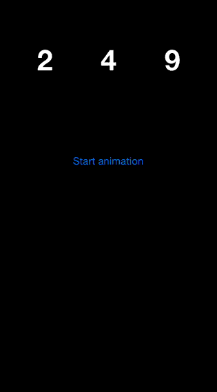

JTNumberScrollAnimatedView
==========================


Use JTNumberScrollAnimatedView for have a nice animation for display number.
It's easy to use, easy to customize.

## Installation

With [CocoaPods](http://cocoapods.org/), add this line to your Podfile.

	pod 'JTNumberScrollAnimatedView', '~> 1.0'

## Screenshots



## Usage

### Basic usage

You can use `JTNumberScrollAnimatedView` like a normal view.

```objective-c
#import <UIKit/UIKit.h>

#import "JTNumberScrollAnimatedView.h"

@interface ViewController : UIViewController

@property (weak, nonatomic) IBOutlet JTNumberScrollAnimatedView *animatedView;

@end
```

You just have to call `setValue` with a NSNumber and use `startAnimation` for launch the animation.

```objective-c
- (void)viewDidLoad
{
    [super viewDidLoad];
        
    [self.animatedView setValue:@249];
}

- (void)viewDidAppear:(BOOL)animated
{
    [super viewDidAppear:animated];
    
    [self.animatedView startAnimation];
}
```

### WARNING

For now the `value` must be a positive integer.

### Customization

You can easily change some properties of the animation.
Each caracter have its own `column`.

- `textColor`
- `font`
- `duration`
- `durationOffset`, delay between the end of the animation of each column
- `density`, number of characters by column for the animation
- `minLength`, you can force the minimum count of columns
- `isAscending`, the direction of the scroll

If you change one of this properties, you have to call `setValue` for update the view.

## Requirements

- iOS 7 or higher
- Automatic Reference Counting (ARC)

## Author

- [Jonathan Tribouharet](https://github.com/jonathantribouharet) ([@johntribouharet](https://twitter.com/johntribouharet))

## License

JTNumberScrollAnimatedView is released under the MIT license. See the LICENSE file for more info.
